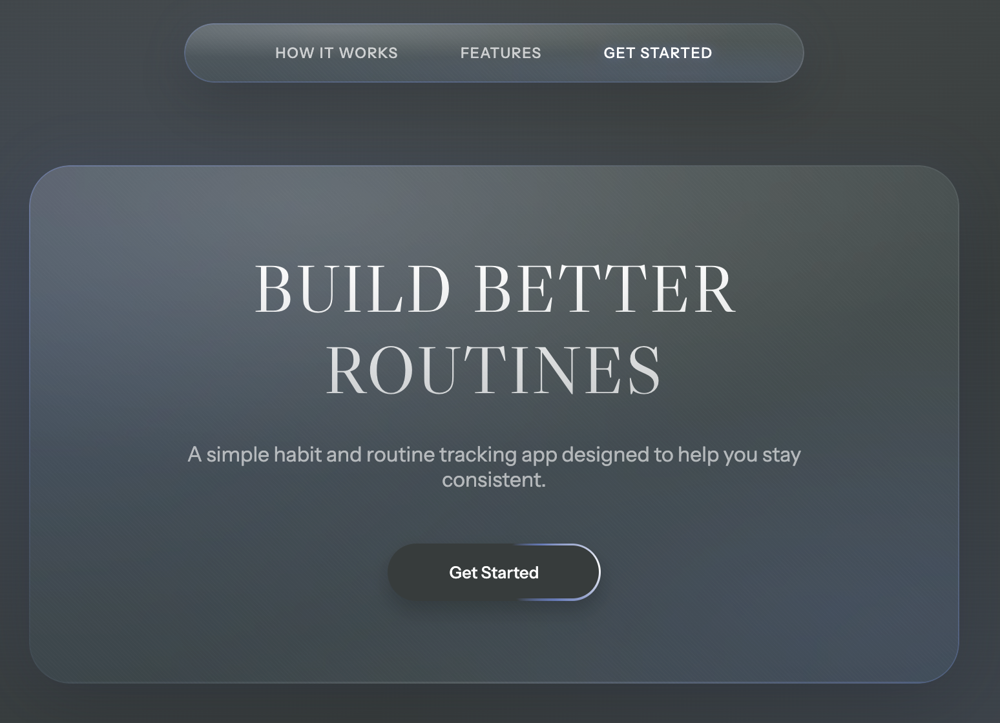
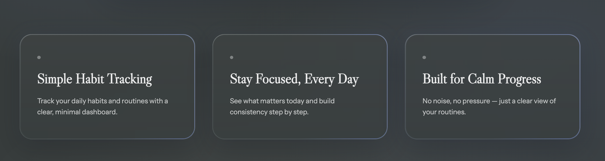
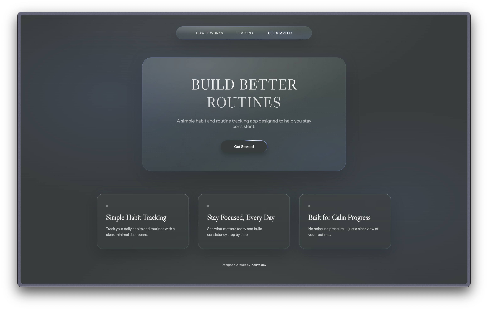

# Routina — Landing Page v1

A minimal, glass-inspired landing page for a habit & routine tracking app.

## What this is
- Product landing page concept
- Designed in Figma
- Built with HTML & CSS
- Focused on clarity, hierarchy and motion

## What this is not
- Not a full app
- Not production-ready backend
- Not a finished product

## Preview

## Live demo
👉 [View live](https://noirys-dev.github.io/routina-landing-page/)

## Status
v1 — frozen

---
Built by noirys.dev
